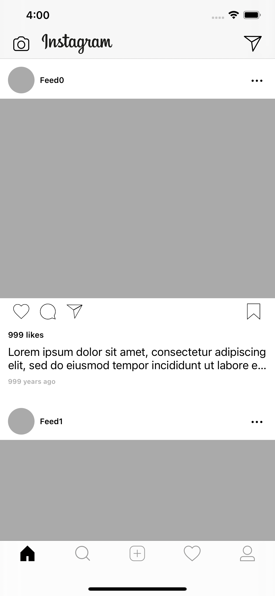

# [iOS] VIPER-Instagram-Skeleton
Developing ...
#
## Clone Instagram application  
Project try to build the skeleton Instagram UI with VIPER architecture.  
Project used [Swift VIPER AutoGen](https://github.com/lamhoangx/iOS_SwiftViperAutoGen.git)
> The template to quickly generates skeleton files that module need to apply VIPER architecture.

## Screenshots
<table>
    <tr>
        <td></td>
    </tr>
</table>

